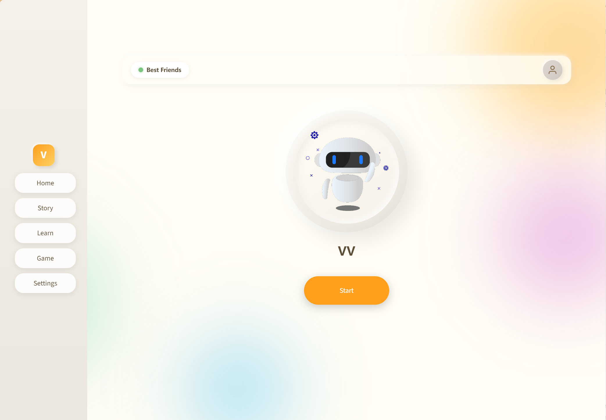

<p align="center">
  
</p>

<h1 align="center">Montessori Intelligence Nexus (MIN)</h1>

<p align="center">
  <strong>Building the AI Operating System for Montessori Education</strong>
</p>

<p align="center">
  
  
  
  
</p>

<p align="center">
  
  
  
</p>

<p align="center">
  <a href="#features">Features</a> |
  <a href="#demo">Demo</a> |
  <a href="#architecture">Architecture</a> |
  <a href="#installation">Installation</a> |
  <a href="#roadmap">Roadmap</a>
</p>

<p align="center">
  <a href="https://kidsbot-nfmrgkmdk8c5uem9jwctj6.streamlit.app/">
    
  </a>
</p>

---

## Overview

**MIN** transforms AMS-standard Montessori methods into a replicable AI teaching engine, delivered through software-led, hardware-supported, classroom-proven systems. Our mission is to ensure every school can consistently deliver high-quality Montessori education.


### The Problem We Solve

| Challenge | Impact | MIN Solution |
|-----------|--------|--------------|
| Great teachers are hard to replicate | Inconsistent quality across classrooms | AI teaching engine with certified methods |
| Quality varies classroom to classroom | Parent frustration, uneven outcomes | Standardized, replicable curriculum delivery |
| High costs due to labor | Limited accessibility | Scalable software reduces per-student cost |
| Parents disconnected from daily learning | Broken learning loop | Real-time engagement and progress tracking |

---


## Features

### AI Teaching Companion (VV)

VV is a friendly AI robot companion designed specifically for young children, implementing authentic Montessori teaching methodology.

| Feature | Description |
|---------|-------------|
| **Three Period Lesson** | Follows authentic Montessori teaching: Naming -> Recognition -> Recall |
| **Multi-Mode Interaction** | Chat, Story, Learning, and Game modes |
| **Voice Security** | Speaker verification ensures only authorized users can interact |
| **Auto-Learning** | Automatically remembers personal facts about the child |
| **Parent Reports** | Daily summaries of child's learning and interests |

### Interaction Modes

```
+------------------+------------------+------------------+------------------+
|      CHAT        |      STORY       |     LEARNING     |      GAME        |
+------------------+------------------+------------------+------------------+
| Friendly         | Magical          | Montessori       | Word games       |
| conversation     | storytelling     | Three Period     | 20 Questions     |
| with VV          | adventures       | Lesson method    | I Spy, Rhymes    |
+------------------+------------------+------------------+------------------+
```

### Voice Interaction

- **Real-time Speech Recognition** with Voice Activity Detection (VAD)
- **Natural Text-to-Speech** using Microsoft Edge Neural voices
- **Child-friendly Voice** (Ana Neural - US English)
- **Continuous Conversation Mode** (Jarvis-style hands-free interaction)
- **Speaker Verification** using voice embeddings (Resemblyzer)

### Knowledge Base (RAG)

- **Montessori Curriculum Integration** - Ingest AMS-certified materials
- **Semantic Search** with sentence-transformers embeddings
- **Memory-efficient Processing** using generators (handles 500MB+ content)
- **Persistent Vector Storage** with ChromaDB

---


### User Interface

The application features a modern, child-friendly interface with soft claymorphism design:



**Key UI Elements:**
- **Sidebar Navigation** - Quick access to Home, Story, Learn, Game, and Settings
- **Robot Avatar** - Animated VV companion with status indicators
- **Voice Button** - One-tap to start/stop conversation
- **Chat History** - Visual conversation flow with TTS playback

### Sample Interaction (Learning Mode - Three Period Lesson)

```
Child: "What is an apple?"

VV (Period 1 - Naming):
"This is an apple. It's round and can be red or green."

VV (Period 2 - Recognition):
"Can you point to something else that is round?"

[Child responds]

VV (Period 3 - Recall):
"Wonderful! Now, what is this fruit called?"
```

---

## Architecture

### High-Level System Design

```
+===========================================================================+
|                           MIN PLATFORM                                     |
+===========================================================================+
|                                                                           |
|    +---------------------------------------------------------------+      |
|    |                    PRESENTATION LAYER                         |      |
|    |  +------------------+  +------------------+  +---------------+ |      |
|    |  |   Streamlit UI   |  |  Claymorphism   |  |   Animated    | |      |
|    |  |   (app.py)       |  |     Styling     |  |   Robot GIF   | |      |
|    |  +------------------+  +------------------+  +---------------+ |      |
|    +---------------------------------------------------------------+      |
|                                    |                                      |
|                                    v                                      |
|    +---------------------------------------------------------------+      |
|    |                    APPLICATION LAYER                          |      |
|    |                                                               |      |
|    |  +------------------+     +------------------+                 |      |
|    |  |   Mode Router    |     |  Response Parser |                 |      |
|    |  | Chat|Story|Learn |     |  [MODE] [ACTION] |                 |      |
|    |  |      |Game       |     |      Tags        |                 |      |
|    |  +------------------+     +------------------+                 |      |
|    |                                                               |      |
|    +---------------------------------------------------------------+      |
|                                    |                                      |
|         +--------------------------|---------------------------+          |
|         |                          |                           |          |
|         v                          v                           v          |
|  +-------------+          +----------------+          +----------------+  |
|  | VOICE LAYER |          |   AI LAYER     |          | MEMORY LAYER   |  |
|  +-------------+          +----------------+          +----------------+  |
|  |             |          |                |          |                |  |
|  | +-------+   |          | +------------+ |          | +------------+ |  |
|  | |  STT  |   |          | | DeepSeek   | |          | | ChromaDB   | |  |
|  | |Google |   |          | |  LLM API   | |          | | Vector DB  | |  |
|  | +-------+   |          | +------------+ |          | +------------+ |  |
|  |             |          |       |        |          |       |        |  |
|  | +-------+   |          | +------------+ |          | +------------+ |  |
|  | |  TTS  |   |          | |   Mode     | |          | |    RAG     | |  |
|  | | Edge  |   |          | |  Prompts   | |          | | Retrieval  | |  |
|  | +-------+   |          | +------------+ |          | +------------+ |  |
|  |             |          |       |        |          |       |        |  |
|  | +-------+   |          | +------------+ |          | +------------+ |  |
|  | |  VAD  |   |          | | Streaming  | |          | |   Auto     | |  |
|  | |WebRTC |   |          | |  Response  | |          | | Learning   | |  |
|  | +-------+   |          | +------------+ |          | +------------+ |  |
|  |             |          |                |          |                |  |
|  | +-------+   |          +----------------+          | +------------+ |  |
|  | |Speaker|   |                                      | | Embeddings | |  |
|  | |Verify |   |                                      | | MiniLM-L6  | |  |
|  | +-------+   |                                      | +------------+ |  |
|  +-------------+                                      +----------------+  |
|                                                                           |
+===========================================================================+
                                    |
                                    v
+===========================================================================+
|                      HARDWARE LAYER (FUTURE)                              |
+===========================================================================+
|  +-----------+  +-----------+  +-----------+  +-----------+              |
|  |Raspberry  |  |  Touch    |  |  Camera   |  | Robotic   |              |
|  |  Pi 5     |  |  Screen   |  |   (CV)    |  |   Arms    |              |
|  +-----------+  +-----------+  +-----------+  +-----------+              |
+===========================================================================+
```

### Data Flow Diagram

```
+--------+     +-----------+     +------------+     +-----------+     +--------+
|  User  | --> |   Voice   | --> |   Speech   | --> |  Speaker  | --> | Voice  |
| Speech |     |   Input   |     |Recognition |     |  Verify   |     |  OK?   |
+--------+     +-----------+     +------------+     +-----------+     +--------+
                                                                          |
                    +-----------------------------------------------------+
                    |                                                     |
                    v                                                     v
              +----------+                                          +---------+
              |  Reject  |                                          |  Query  |
              |  Access  |                                          |   RAG   |
              +----------+                                          +---------+
                                                                          |
                                                                          v
                                                                    +-----------+
                                                                    |  Context  |
                                                                    |  Chunks   |
                                                                    +-----------+
                                                                          |
                    +-----------------------------------------------------+
                    |
                    v
              +------------+     +------------+     +------------+     +--------+
              |  DeepSeek  | --> |  Response  | --> |  Parse     | --> |  TTS   |
              |    LLM     |     |  Stream    |     |  [TAGS]    |     | Output |
              +------------+     +------------+     +------------+     +--------+
                                                          |
                                                          v
                                                    +------------+
                                                    | Mode/Action|
                                                    |  Control   |
                                                    +------------+
```

### Component Interaction

```
                              USER INTERACTION
                                     |
                                     v
+----------------------------------------------------------------------------+
|                            STREAMLIT FRONTEND                               |
|  +------------------+  +------------------+  +------------------+           |
|  |    Sidebar       |  |   Robot Display  |  |   Chat History   |           |
|  |   Navigation     |  |    + Controls    |  |    + TTS Play    |           |
|  +------------------+  +------------------+  +------------------+           |
+----------------------------------------------------------------------------+
          |                        |                        |
          v                        v                        v
+-------------------+    +-------------------+    +-------------------+
|   Mode Manager    |    |  Audio Manager    |    |  Session State    |
|                   |    |                   |    |                   |
| - Chat Mode       |    | - Microphone      |    | - Messages        |
| - Story Mode      |    | - Speaker         |    | - User Prefs      |
| - Learning Mode   |    | - VAD Detection   |    | - Mode State      |
| - Game Mode       |    | - Voice Verify    |    | - Audio Queue     |
+-------------------+    +-------------------+    +-------------------+
          |                        |                        |
          +------------------------+------------------------+
                                   |
                                   v
+----------------------------------------------------------------------------+
|                              CORE ENGINE                                    |
|  +------------------+  +------------------+  +------------------+           |
|  |   LLM Client     |  |  Memory Manager  |  |  Voice Security  |           |
|  |   (DeepSeek)     |  |    (ChromaDB)    |  |  (Resemblyzer)   |           |
|  +------------------+  +------------------+  +------------------+           |
+----------------------------------------------------------------------------+
          |                        |                        |
          v                        v                        v
+-------------------+    +-------------------+    +-------------------+
|   DeepSeek API    |    |   Vector Store    |    |   Voice Prints    |
|   (External)      |    |   (Local/Cloud)   |    |     (Local)       |
+-------------------+    +-------------------+    +-------------------+
```

### Three Period Lesson Flow

```
+=========================================================================+
|                    MONTESSORI THREE PERIOD LESSON                        |
+=========================================================================+
|                                                                         |
|   PERIOD 1: NAMING                                                      |
|   +---------------------------+                                         |
|   | "This is an apple."       |  <-- Short, clear introduction          |
|   | (One sentence only)       |      No explanation or lecture          |
|   +---------------------------+                                         |
|                |                                                        |
|                v                                                        |
|   PERIOD 2: RECOGNITION                                                 |
|   +---------------------------+                                         |
|   | "Can you show me the      |  <-- Child identifies/demonstrates      |
|   |  apple?"                  |      Builds neural pathways             |
|   | "Which one is red?"       |                                         |
|   +---------------------------+                                         |
|                |                                                        |
|                v                                                        |
|   PERIOD 3: RECALL                                                      |
|   +---------------------------+                                         |
|   | "What is this?"           |  <-- Child names it independently       |
|   | (Let child answer)        |      Confirms learning complete         |
|   +---------------------------+                                         |
|                |                                                        |
|                v                                                        |
|   +---------------------------+                                         |
|   |  If struggle: Return to   |  <-- Gentle, patient repetition         |
|   |  Period 1 with kindness   |                                         |
|   +---------------------------+                                         |
|                                                                         |
+=========================================================================+
```

### Project Structure

```
kidBot/
+-- app.py                    # Main Streamlit application
+-- admin.py                  # Admin panel for registration
+-- config.yaml               # Robot configuration
+-- requirements.txt          # Python dependencies
+-- packages.txt              # System dependencies (for cloud deploy)
|
+-- core/
|   +-- llm_client.py         # DeepSeek API client with mode prompts
|   +-- memory_rag.py         # ChromaDB + RAG memory manager
|   +-- voice_security.py     # Speaker verification (Resemblyzer)
|   +-- response_parser.py    # Parse mode/action tags from responses
|   +-- registration.py       # Owner voice registration
|   +-- utils.py              # Configuration and utilities
|
+-- interfaces/
|   +-- audio_io.py           # AudioManager (STT + TTS + VAD)
|
+-- ui/
|   +-- styles.py             # CSS styling (Claymorphism design)
|   +-- components.py         # Reusable UI components
|   +-- views/
|       +-- settings_view.py  # Settings page
|
+-- scripts/
|   +-- register_owner.py     # CLI voice registration
|   +-- jarvis.py             # Standalone voice assistant
|
+-- data/
|   +-- raw_docs/             # Montessori curriculum files
|   +-- vector_store/         # ChromaDB persistent storage
|   +-- voice_prints/         # Owner voice embeddings
|
+-- assets/
    +-- bot.gif               # Animated robot avatar
    +-- bot.jpg               # Static robot image
```

---

## Installation

### Prerequisites

- Python 3.10+
- Microphone and speakers (for local voice interaction)
- DeepSeek API key ([get one here](https://platform.deepseek.com/))

### Quick Start

```bash
# 1. Clone the repository
git clone https://github.com/yourusername/kidBot.git
cd kidBot

# 2. Create virtual environment
python -m venv venv
source venv/bin/activate  # On Windows: venv\Scripts\activate

# 3. Install dependencies
pip install -r requirements.txt

# 4. Configure environment
cp .env.example .env
# Edit .env with your DeepSeek API key:
# DEEPSEEK_API_KEY=your_key_here

# 5. Configure robot settings (optional)
cp config.yaml.example config.yaml
# Customize name, personality, voice settings

# 6. Run the admin panel first (to register owner voice)
streamlit run admin.py

# 7. Run the main application
streamlit run app.py
```

### Cloud Deployment (Streamlit Cloud)

The application supports deployment on Streamlit Cloud with some limitations:

1. **PyAudio is optional** - Microphone features use browser audio input
2. **Add `packages.txt`** for system dependencies:
   ```
   portaudio19-dev
   libasound2-dev
   ```
3. **Voice features** - Use `st.audio_input()` for browser-based recording

---

## Configuration

### config.yaml

```yaml
# Robot Identity
robot:
  name: "VV"
  personality: "A 6-year-old curious and friendly robot who loves
    to learn and play. Speaks in simple, cheerful sentences that
    children can understand. Always positive and encouraging."

# API Configuration
api:
  deepseek:
    base_url: "https://api.deepseek.com"
    model: "deepseek-chat"

# Audio Settings
audio:
  tts_voice: "en-US-AnaNeural"  # Child-friendly voice
  listen_timeout: 10
  energy_threshold: 300

# RAG Settings
rag:
  chunk_size: 500
  chunk_overlap: 50
  top_k: 3
```

### Mode Prompts

Each interaction mode has a specialized system prompt:

| Mode | Personality | Methodology |
|------|-------------|-------------|
| **Chat** | Friendly companion | Concise responses (1-2 sentences) |
| **Story** | Magical storyteller | Interactive story creation |
| **Learning** | Montessori guide | Three Period Lesson methodology |
| **Game** | Game master | Word games, 20 Questions, I Spy |

---

## Roadmap

### Technology Evolution

```
+====================+     +====================+     +====================+
|     PHASE 1        |     |     PHASE 2        |     |     PHASE 3        |
|     SOFTWARE       | --> |     HARDWARE       | --> |     ROBOTICS       |
|   (Current MVP)    |     |   (Coming Soon)    |     |    (Future)        |
+====================+     +====================+     +====================+
|                    |     |                    |     |                    |
| [x] AI Engine      |     | [ ] Raspberry Pi 5 |     | [ ] Robotic Arms   |
| [x] RAG Knowledge  |     | [ ] Touch Screen   |     | [ ] Material Demo  |
| [x] Voice I/O      |     | [ ] Camera (CV)    |     | [ ] Generative     |
| [x] Web Interface  |     | [ ] LED Indicators |     |     Demonstrations |
| [x] Speaker Verify |     | [ ] Physical Button|     | [ ] Multi-modal    |
| [x] Three Period   |     | [ ] Offline LLM    |     |     Teaching       |
|                    |     |                    |     |                    |
+====================+     +====================+     +====================+
         |                          |                          |
         v                          v                          v
+========================================================================+
|              AMS-Certified Montessori Knowledge Base                    |
|                   (Exclusive FMAE Training Data)                        |
+========================================================================+
```

### Phase 1: Software MVP (Current)

- [x] Voice input/output with edge-tts and VAD
- [x] RAG-based knowledge retrieval (ChromaDB)
- [x] DeepSeek LLM integration with streaming
- [x] Multi-mode interaction (Chat, Story, Learning, Game)
- [x] Montessori Three Period Lesson methodology
- [x] Speaker verification (voice security)
- [x] Auto-learning of personal facts
- [x] Web interface with Streamlit
- [x] Continuous conversation mode (Jarvis)
- [ ] Parent daily reports
- [ ] Multi-language support

### Phase 2: Hardware Integration

- [ ] Raspberry Pi 5 deployment package
- [ ] Touch screen display for visual aids
- [ ] Camera integration for engagement detection
- [ ] LED status indicators (listening, thinking, speaking)
- [ ] Physical button controls
- [ ] Offline mode with local LLM

### Phase 3: Advanced Robotics

- [ ] Robotic arms for physical demonstrations
- [ ] Generative material manipulation
- [ ] Computer vision for object recognition
- [ ] Multi-modal teaching (visual + audio + physical)
- [ ] Classroom-scale multi-device deployment

---

## Business Model

### Revenue Strategy

| Stream | Description | Pricing |
|--------|-------------|---------|
| **Subscription** | Base platform access | $3,500/school/month |
| **Revenue Share** | Aligned upside | 15% of incremental tuition |

### Key Metrics

| Metric | Value |
|--------|-------|
| CAC | $24,500 per school |
| LTV | $286,000 per school |
| Payback Period | 14 months |
| Gross Margin (SaaS) | 75%+ |
| Gross Margin (Hardware) | ~30% |

### Go-to-Market Strategy

```
+------------------+     +------------------+     +------------------+
|  Phase 1: 0->1   | --> |  Phase 2: 1->10  | --> | Phase 3: 10->100 |
+------------------+     +------------------+     +------------------+
|                  |     |                  |     |                  |
| Internal Pilots  |     | AMS Partnership  |     | National Scale   |
|                  |     |                  |     |                  |
| - Prove ROI      |     | - Industry Std   |     | - Tech-in-a-Box  |
| - Efficiency     |     | - Adoption focus |     | - Upgrades       |
| - Parent value   |     | - Certification  |     | - Family products|
+------------------+     +------------------+     +------------------+
```

---

## Our Competitive Advantage

Built on **FMAE** with four operating Montessori kindergartens:

| Advantage | Description |
|-----------|-------------|
| **Official Certification** | Direct access to AMS Montessori certification |
| **Real Classrooms** | Experiment and validate in actual learning environments |
| **Exclusive Data** | High-quality Montessori materials for AI training |
| **Domain Expertise** | Founding team includes experienced Montessori principals |
| **Pedagogical Accuracy** | True Three Period Lesson implementation, not generic tutoring |

---

## Team

Our core founding team comes from **Stanford**, **UPenn**, **Harvard**, and includes an **experienced Montessori school principal** with 4 operating Montessori schools.

**Author:** Ming Xia

---

## Troubleshooting

| Issue | Solution |
|-------|----------|
| `DEEPSEEK_API_KEY not found` | Check `.env` file contains your API key |
| `PyAudio not available` | Install with `pip install pyaudio` (requires PortAudio) |
| `No microphone found` | Check system audio permissions |
| `Speech synthesis error` | Restart the application |
| `ChromaDB connection error` | Ensure `data/vector_store/` directory exists |
| `Voice not recognized` | Re-register owner voice in admin panel |

---

## API Reference

### Core Components

```python
# LLM Client
from core.llm_client import DeepSeekClient
client = DeepSeekClient(config)
response = client.get_response(user_input, context_chunks, mode="learning")

# Memory Manager
from core.memory_rag import get_memory_manager
memory = get_memory_manager(config)
chunks = memory.query_memory(query, top_k=3)

# Voice Security
from core.voice_security import get_voice_gatekeeper
gatekeeper = get_voice_gatekeeper(config)
is_owner = gatekeeper.verify_user(audio_path)

# Audio Manager
from interfaces.audio_io import AudioManager
audio = AudioManager(config)
text, path = audio.listen_and_save("recording.wav")
audio.speak("Hello!")
```

---

## Contributing

We welcome contributions! Please see our contributing guidelines for details.

### Development Setup

```bash
# Install dev dependencies
pip install -r requirements-dev.txt

# Run tests
pytest tests/

# Code formatting
black .
isort .
```

---

## License

Proprietary - Montessori Intelligence Nexus

---

## Fundraising

### Seed Round

| Item | Value |
|------|-------|
| **Target** | $8.5M |
| **Pre-money Valuation** | $45M |

### Use of Funds

| Category | Allocation |
|----------|------------|
| R&D | 35% |
| Compliance & Certification | 25% |
| Pilot Deployment & Data | 20% |
| Talent | 15% |

---