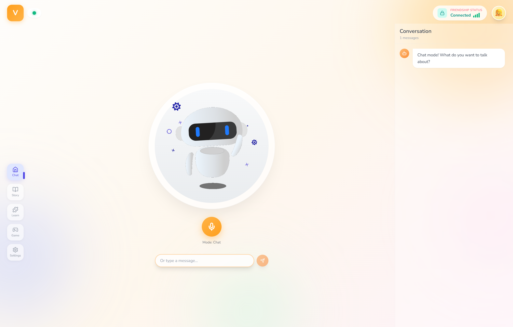

<p align="center">
  
</p>

<h1 align="center">Montessori Intelligence Nexus</h1>

<p align="center">
  <strong>The AI Operating System for Montessori Education</strong>
</p>

<p align="center">
  <em>Software-led. Hardware-supported. Classroom-proven.</em>
</p>

<p align="center">
  
  
  
  
  
  
</p>

<p align="center">
  
  
</p>

<br/>

<p align="center">
  
</p>

---

## Executive Summary

**Montessori Intelligence Nexus (MIN)** transforms AMS-certified Montessori methodology into a scalable AI teaching engine. We solve the fundamental challenge in early childhood education: **great teachers are impossible to replicate at scale**.

Our platform delivers consistent, high-quality Montessori education through an AI companion named **VV**, enabling schools to maintain pedagogical excellence while reducing operational costs.

<table>
<tr>
<td width="50%">

### The Problem

- Quality varies classroom to classroom
- Great teachers are scarce and expensive  
- Parents disconnected from daily learning
- High costs limit accessibility

</td>
<td width="50%">

### Our Solution

- AI engine with certified Montessori methods
- Standardized, replicable curriculum delivery
- Real-time parent engagement & progress tracking
- Scalable software reduces per-student cost

</td>
</tr>
</table>

---

## Platform Overview

### VV: AI Teaching Companion

VV is a voice-first AI companion implementing authentic **Montessori Three Period Lesson** methodology:

| Mode | Description | Methodology |
|------|-------------|-------------|
| **Chat** | Natural conversation | Friendly, age-appropriate dialogue |
| **Story** | Interactive storytelling | Creative, child-led narrative building |
| **Learn** | Educational content | Three Period Lesson (Naming → Recognition → Recall) |
| **Game** | Word games & activities | 20 Questions, I Spy, Rhyme Time |

### Key Capabilities

| Feature | Technology | Description |
|---------|------------|-------------|
| **Voice Interaction** | WebRTC + VAD | Hands-free, Jarvis-style continuous conversation |
| **Speech Recognition** | Google STT + FFmpeg | Real-time transcription with noise reduction |
| **Text-to-Speech** | Edge TTS (Multi-voice) | Natural voices in English, Chinese, Spanish, Japanese |
| **Multi-Language** | Auto-Detection | Responds in the same language the child speaks |
| **Knowledge Base** | ChromaDB + RAG | Semantic search over Montessori curriculum |
| **Auto-Learning** | LLM Extraction | Remembers personal facts about each child |
| **Mode Switching** | Voice Commands | Instant transitions with spoken confirmation |
| **Parent Portal** | React + Email | Registration, daily reports, progress tracking |
| **Daily Reports** | LLM Summary | Automated learning summaries sent via email |

---

## Technical Architecture

```
┌─────────────────────────────────────────────────────────────────────────────┐
│                              MIN PLATFORM                                    │
├─────────────────────────────────────────────────────────────────────────────┤
│                                                                              │
│  ┌────────────────────────────────────────────────────────────────────────┐ │
│  │                         PRESENTATION LAYER                              │ │
│  │  ┌──────────────┐  ┌──────────────┐  ┌──────────────┐  ┌────────────┐  │ │
│  │  │   React 18   │  │  Tailwind    │  │   Framer     │  │   Zustand  │  │ │
│  │  │  TypeScript  │  │     CSS      │  │   Motion     │  │   State    │  │ │
│  │  └──────────────┘  └──────────────┘  └──────────────┘  └────────────┘  │ │
│  └────────────────────────────────────────────────────────────────────────┘ │
│                                      │                                       │
│                                      ▼                                       │
│  ┌────────────────────────────────────────────────────────────────────────┐ │
│  │                           API LAYER (FastAPI)                           │ │
│  │  ┌──────────────┐  ┌──────────────┐  ┌──────────────┐  ┌────────────┐  │ │
│  │  │  REST API    │  │  WebSocket   │  │     SSE      │  │    CORS    │  │ │
│  │  │  Endpoints   │  │   Real-time  │  │   Streaming  │  │  Middleware│  │ │
│  │  └──────────────┘  └──────────────┘  └──────────────┘  └────────────┘  │ │
│  └────────────────────────────────────────────────────────────────────────┘ │
│                                      │                                       │
│         ┌────────────────────────────┼────────────────────────────┐         │
│         ▼                            ▼                            ▼         │
│  ┌─────────────┐            ┌─────────────┐            ┌─────────────────┐  │
│  │ VOICE ENGINE│            │  AI ENGINE  │            │  MEMORY ENGINE  │  │
│  ├─────────────┤            ├─────────────┤            ├─────────────────┤  │
│  │ STT (Google)│            │DeepSeek LLM │            │ ChromaDB Vector │  │
│  │ TTS (Edge)  │            │Mode Prompts │            │ RAG Retrieval   │  │
│  │ VAD (WebRTC)│            │  Streaming  │            │ Auto-Learning   │  │
│  │ FFmpeg      │            │ Tag Parsing │            │ MiniLM-L6 Embed │  │
│  └─────────────┘            └─────────────┘            └─────────────────┘  │
│                                                                              │
└─────────────────────────────────────────────────────────────────────────────┘
```

### Technology Stack

| Layer | Technologies |
|-------|-------------|
| **Frontend** | React 18, TypeScript, Vite, Tailwind CSS, Framer Motion, Zustand |
| **Backend** | FastAPI, Python 3.10+, Uvicorn, Pydantic |
| **AI/ML** | DeepSeek LLM, Sentence-Transformers, ChromaDB |
| **Voice** | Google Speech Recognition, Edge TTS, WebRTC VAD |
| **Infrastructure** | Docker-ready, Raspberry Pi compatible |

### API Endpoints

| Endpoint | Method | Description |
|----------|--------|-------------|
| `/api/status` | GET | System health and registration status |
| `/api/chat` | POST | Send message, receive AI response |
| `/api/chat/stream` | POST | Stream response via SSE |
| `/api/voice/transcribe` | POST | Audio to text transcription |
| `/api/tts` | POST | Text to speech synthesis |
| `/api/memory/save` | POST | Store user information |
| `/api/memory/search` | GET | Query knowledge base |
| `/api/parent/register` | POST | Register parent & child profile |
| `/api/parent/profile` | GET/PUT | Get or update parent profile |
| `/api/reports` | GET | Get daily learning reports |
| `/api/reports/generate` | POST | Generate today's report |
| `/api/reports/test` | POST | Send test report email |
| `/ws/chat` | WS | Real-time bidirectional chat |

---

## Multi-Language Support 

VV automatically detects and responds in the language your child speaks:

| Language | TTS Voice | Example |
|----------|-----------|---------|
| English | Ana Neural | "Hello! What would you like to learn today?" |
| Chinese | Xiaoxiao Neural | "你好！今天想学什么呢？" |
| Spanish | Dalia Neural | "Hola! Que te gustaria aprender hoy?" |
| Japanese | Nanami Neural | "こんにちは！今日は何を学びたい？" |

### How It Works

1. **Speech Recognition** - Google STT transcribes in any supported language
2. **Language Detection** - LLM detects input language automatically
3. **Response Generation** - AI responds in the same language
4. **Voice Synthesis** - Edge TTS uses language-appropriate voice

No configuration needed - just speak to VV in your preferred language!

---

## Parent Portal & Daily Reports

### Parent Registration

New users are guided through a 4-step registration process:

1. **Parent Info** - Name and email for report delivery
2. **Child Info** - Child's name and age for personalization
3. **Interests** - Select topics the child enjoys (animals, space, music, etc.)
4. **Report Settings** - Enable/disable daily reports and set delivery time

### Daily Learning Reports

VV automatically tracks all interactions and generates AI-powered daily summaries:

| Report Component | Description |
|------------------|-------------|
| **Summary** | 2-3 sentence overview of the day's learning |
| **Topics Discussed** | Main subjects covered in conversations |
| **Skills Practiced** | Communication, creativity, problem-solving, etc. |
| **Mood Assessment** | Happy, curious, calm, or energetic |
| **Recommendations** | Personalized suggestions for parents |
| **Statistics** | Interaction count and time spent |

### Email Configuration

To enable email delivery, set these environment variables:

```bash
SMTP_SERVER=smtp.gmail.com
SMTP_PORT=587
SMTP_USER=your-email@gmail.com
SMTP_PASS=your-app-password
```

---

## Project Structure

```
kidBot/
├── frontend/                    # React Application
│   ├── src/
│   │   ├── components/          # UI Components
│   │   │   ├── Header.tsx       # Navigation header
│   │   │   ├── Sidebar.tsx      # Mode navigation (desktop & mobile)
│   │   │   ├── RobotAvatar.tsx  # VV companion display
│   │   │   ├── MicButton.tsx    # Voice control
│   │   │   ├── ChatHistory.tsx  # Conversation view
│   │   │   └── JarvisStatus.tsx # Voice activity indicator
│   │   ├── views/
│   │   │   ├── ChatView.tsx     # Main interaction view
│   │   │   ├── SettingsView.tsx # Configuration
│   │   │   └── RegisterView.tsx # Parent registration wizard
│   │   ├── store/
│   │   │   └── useStore.ts      # Zustand state management
│   │   ├── api/
│   │   │   └── client.ts        # API client
│   │   └── types/
│   │       └── index.ts         # TypeScript interfaces
│   ├── public/
│   │   ├── bot.gif              # VV avatar animation
│   │   └── manifest.json        # PWA manifest
│   ├── package.json
│   ├── vite.config.ts
│   └── tailwind.config.js
│
├── backend/                     # FastAPI Server
│   ├── app/
│   │   ├── main.py              # FastAPI entry point
│   │   ├── config.py            # Configuration loader
│   │   ├── api/                 # API routes
│   │   │   ├── chat.py          # Chat endpoints
│   │   │   ├── voice.py         # TTS/STT endpoints
│   │   │   ├── parent.py        # Parent registration
│   │   │   └── memory.py        # RAG endpoints
│   │   ├── core/                # Business logic
│   │   │   ├── llm_client.py    # DeepSeek integration
│   │   │   ├── memory.py        # ChromaDB RAG
│   │   │   ├── voice_security.py# Speaker verification
│   │   │   └── dependencies.py  # Dependency injection
│   │   ├── services/            # Business services
│   │   │   ├── interactions.py  # Interaction tracking
│   │   │   └── email.py         # Email service
│   │   └── models/
│   │       └── schemas.py       # Pydantic models
│   └── requirements.txt
│
├── config/
│   ├── config.yaml              # Application configuration
│   └── config.yaml.example      # Template configuration
│
├── data/
│   ├── raw_docs/                # Montessori curriculum
│   ├── vector_store/            # ChromaDB persistence
│   └── voice_prints/            # Speaker embeddings
│
├── scripts/
│   ├── dev.py                   # Development server runner
│   └── setup.py                 # Project setup script
│
├── assets/
│   └── bot.gif                  # VV avatar animation
│
├── .env.example                 # Environment variables template
├── .gitignore                   # Git ignore rules
├── requirements.txt             # Root Python dependencies
└── README.md                    # This file
```

---

## Quick Start

### Prerequisites

- Node.js 18+ and npm
- Python 3.10+
- FFmpeg (for audio processing)
- DeepSeek API key

### Installation

```bash
# Clone repository
git clone https://github.com/your-org/kidBot.git
cd kidBot

# Option 1: Quick setup (recommended)
python scripts/setup.py

# Option 2: Manual setup
python -m venv venv
source venv/bin/activate  # Windows: venv\Scripts\activate
pip install -r requirements.txt

cd frontend
npm install
cd ..

# Environment configuration
cp .env.example .env
# Edit .env and add your DEEPSEEK_API_KEY
```

### Running the Application

**Option 1: Development script (starts both servers):**
```bash
python scripts/dev.py
```

**Option 2: Manual startup:**

Terminal 1 - Backend:
```bash
python -m uvicorn backend.app.main:app --reload --host 0.0.0.0 --port 8000
```

Terminal 2 - Frontend:
```bash
cd frontend
npm run dev
```

Access the application at `http://localhost:5173`

### API Documentation

Once running, visit `http://localhost:8000/docs` for interactive API documentation.

---

## Configuration

### Environment Variables

| Variable | Required | Description |
|----------|----------|-------------|
| `DEEPSEEK_API_KEY` | Yes | DeepSeek API authentication |
| `HF_TOKEN` | No | Hugging Face token for embeddings |

### config.yaml

```yaml
robot:
  name: "VV"
  personality: "A 6-year-old curious and friendly robot who loves
    to learn and play. Speaks in simple, cheerful sentences."

api:
  deepseek:
    base_url: "https://api.deepseek.com"
    model: "deepseek-chat"

audio:
  tts_voice: "en-US-AnaNeural"
  listen_timeout: 10

rag:
  chunk_size: 500
  chunk_overlap: 50
  top_k: 3
```

---

## Product Roadmap

### Phase 1: Software MVP (Complete)

- [x] Voice-first AI interaction with VAD
- [x] Multi-mode teaching (Chat, Story, Learn, Game)
- [x] Montessori Three Period Lesson methodology
- [x] RAG-based knowledge retrieval
- [x] Auto-learning of personal facts
- [x] Continuous conversation mode
- [x] React + FastAPI architecture
- [x] Parent registration system
- [x] Daily learning reports (email)
- [x] Multi-language support (EN/ZH/ES/JA)

### Phase 2: Hardware Integration

- [ ] Raspberry Pi 5 deployment
- [ ] Touch screen display
- [ ] Camera for engagement detection
- [ ] LED status indicators
- [x] ~~Offline mode with local LLM~~ (Not applicable - requires >4GB storage; using DeepSeek API instead)

### Phase 3: Advanced Robotics

- [ ] Robotic arms for demonstrations
- [ ] Computer vision object recognition
- [ ] Multi-modal teaching
- [ ] Classroom-scale deployment

---

## Business Model

| Revenue Stream | Description |
|----------------|-------------|
| **Platform Subscription** | $3,500/school/month base access |
| **Revenue Share** | 15% of incremental tuition growth |

### Unit Economics

| Metric | Value |
|--------|-------|
| CAC | $24,500 |
| LTV | $286,000 |
| Payback Period | 14 months |
| Gross Margin (SaaS) | 75%+ |

---

## Competitive Advantage

Built on **FMAE** with four operating Montessori kindergartens:

| Advantage | Description |
|-----------|-------------|
| **AMS Certification** | Direct access to official Montessori certification |
| **Real Classrooms** | Validate in actual learning environments |
| **Exclusive Data** | High-quality Montessori materials for AI training |
| **Domain Expertise** | Founding team includes experienced Montessori principals |
| **Pedagogical Accuracy** | True Three Period Lesson, not generic tutoring |

---

## Team

Core founding team from **Stanford**, **UPenn**, **Harvard**, with an experienced **Montessori school principal** operating 4 schools.

---

## Fundraising

### Seed Round

| | |
|---|---|
| **Target** | $8.5M |
| **Pre-money Valuation** | $45M |

### Use of Funds

| Category | Allocation |
|----------|------------|
| R&D | 35% |
| Compliance & Certification | 25% |
| Pilot Deployment & Data | 20% |
| Talent | 15% |

---

## Support

| Issue | Solution |
|-------|----------|
| `DEEPSEEK_API_KEY not found` | Add key to `.env` file |
| Audio transcription fails | Ensure FFmpeg is installed |
| Microphone not working | Check browser permissions |
| ChromaDB error | Verify `data/vector_store/` exists |

---

## License

Proprietary © 2024 Montessori Intelligence Nexus

---

<p align="center">
  <strong>Building the future of Montessori education, one child at a time.</strong>
</p>
